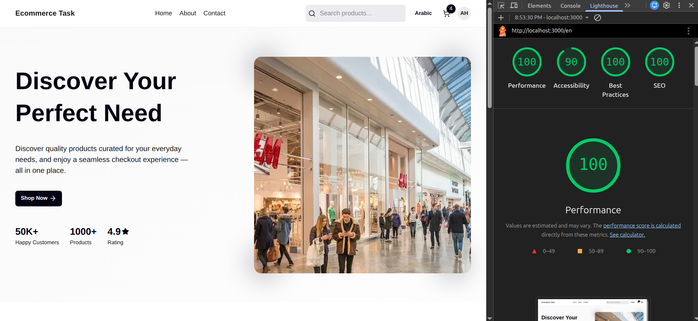
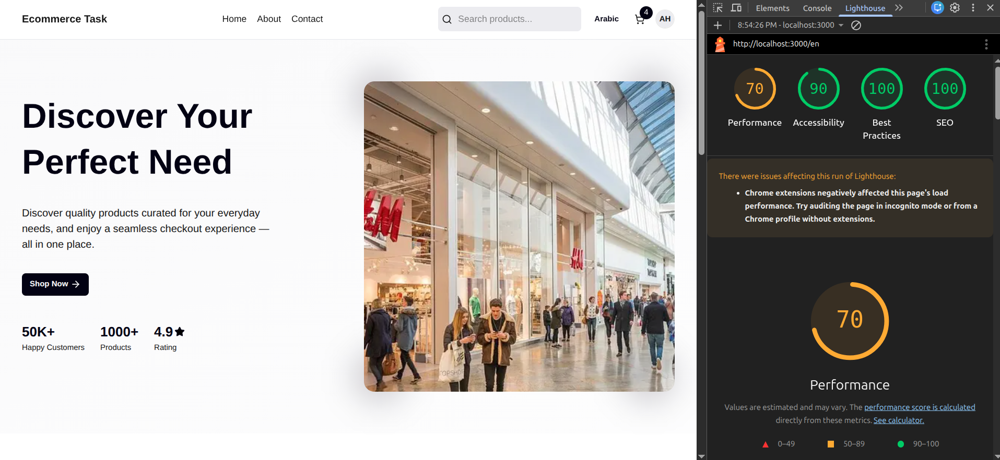
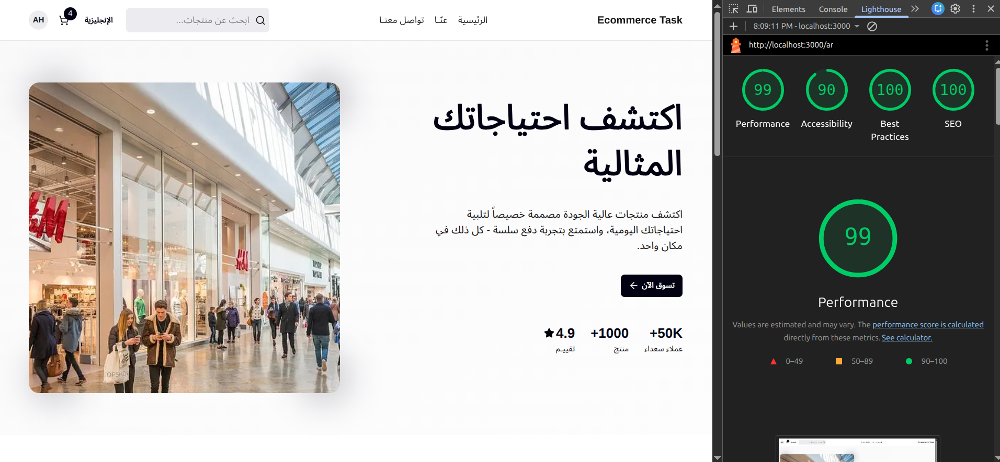
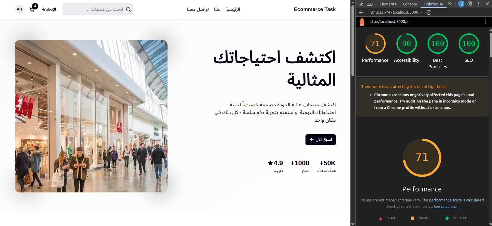

# 🛍️ Multilingual E-Commerce App (Next.js 16)

A modern multilingual e-commerce web app built with **Next.js App Router**, featuring authentication, cart system, SEO optimization, and full Arabic/English support using **next-intl**.

---

# 🚀 Live Demo

Deployed on Vercel
https://front-ecommerce-task.vercel.app

---

# 🧰 Tech Stack

| Tech                        | Why                                              |
| --------------------------- | ------------------------------------------------ |
| **Next.js 16 (App Router)** | Full-stack React framework with SSR/SEO support  |
| **TypeScript**              | Type safety & maintainability                    |
| **Tailwind CSS**            | Fast responsive styling                          |
| **Zustand**                 | Lightweight global state (cart & auth hydration) |
| **next-intl**               | Localization (EN / AR)                           |
| **react-hook-form**         | Lean form handling            |
| **Zod**                     | Form validation with localized errors            |
| **Lucide-react**            | Icons                                            |
| **Mock JSON data**          | No database required                             |

---

# ⚙️ Setup & Run Instructions

## 1️⃣ Clone repo

```bash
git clone https://github.com/AmrNasem/ecommerce-task.git
cd ecommerce-task
```

## 2️⃣ Install dependencies

```bash
npm install
```

## 3️⃣ Create environment file

Create `.env`

```env
NEXT_PUBLIC_BASE_URL=http://localhost:3000
```

(For production use your deployed domain)

## 4️⃣ Run dev server

```bash
npm run dev
```

Open:

```
http://localhost:3000
```

---

# 🌍 Features

## 🛒 E-commerce

* Product listing
* Single product page
* Category filtering
* Price sorting (asc/desc)
* Add to cart (Zustand)
* Quantity update
* Subtotal, tax, total calculation

## 🔐 Authentication (Mock)

* Signup & login (no DB)
* Cookie session
* Protected routes
* Auth pages blocked if logged in
* Hydrated user global state

## 🌐 Localization

* Arabic & English
* Route-based locale `/en`, `/ar`
* Translated metadata
* Localized Zod validation
* API localized errors
* RTL support

## 📱 UI

* Responsive design
* Category cards
* Styled 404 page
* Contact form validation

---

# 🧠 Tech Choices & Tradeoffs

## Why Next.js App Router?

**Pros**

* Server components
* Built-in SEO
* Metadata API
* API routes
* Static + dynamic rendering

**Tradeoff**

* More complex routing
* Learning curve vs CRA

---

## Why Zustand?

**Pros**

* Lightweight
* Simple API
* No boilerplate
* Perfect for cart/auth

**Tradeoff**

* Not ideal for very huge apps
* No devtools like Redux by default

---

## Why next-intl?

**Pros**

* Official Next.js-friendly i18n
* Works with App Router
* Supports metadata localization
* Server & client translations

**Tradeoff**

* Setup slightly tricky initially

---

## Why mock data instead of DB?

**Pros**

* Faster development
* Easy deployment
* No backend setup

**Tradeoff**

* Not persistent
* For demo purposes only

---

# 🔍 SEO Implementation Checklist

## ✅ Core SEO

* [x] Metadata per page
* [x] Dynamic product metadata
* [x] Localized titles/descriptions
* [x] Canonical URLs
* [x] OpenGraph tags
* [x] Twitter meta tags
* [x] Robots meta control

---

## 🌍 International SEO

* [x] hreflang (EN/AR)
* [x] Alternate links
* [x] Locale-based routing
* [x] RTL support

---

## 🗺️ Technical SEO

* [x] sitemap.xml
* [x] robots.txt
* [x] Server-side rendering
* [x] Clean URLs
* [x] 404 page
* [x] Noindex auth pages
* [x] Canonical URLs

---

## ⚡ Performance SEO

* [x] Image optimization
* [x] Lazy loading images
* [x] Static rendering where possible
* [x] Minimal client JS
* [x] Mobile responsive

---

## 📸 Lighthouse Results

| English Desktop | English Mobile |
|-----------------|---------------|
|  |  |

| Arabic Desktop | Arabic Mobile |
|----------------|--------------|
|  |  |

---

# 🧑‍💻 Author

**Amr Nasem**
Frontend Developer (React / Next.js)

---

# ⭐ Notes

This project focuses on:

* Production-ready SEO
* Modern Next.js architecture
* Clean scalable structure
* Multilingual support

---

# 🏁 Future Improvements

* Real database (Prisma)
* Stripe payments
* Admin dashboard
* Product search
* Reviews system
* Server caching (Redis)
* PWA support

---

# 📜 License

MIT
